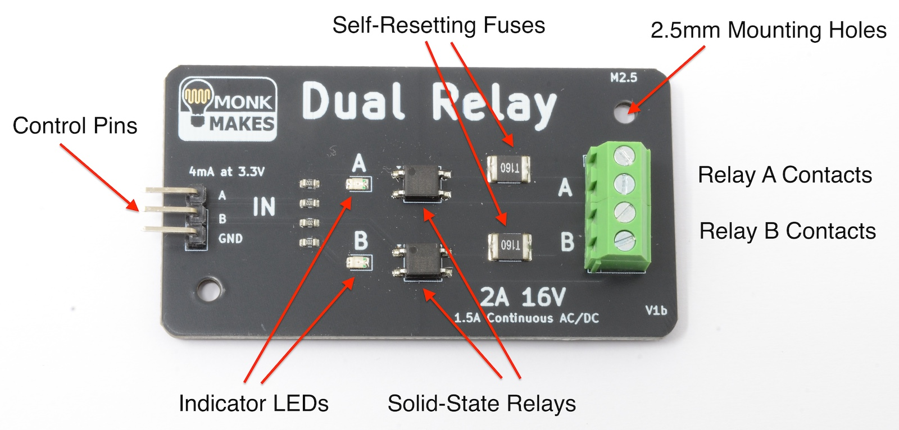

# MonkMakes Dual Relay

This repository contains example code for the [MonkMakes Dual Relay](https://monkmakes.com/dual_relay).

# Introduction

This two channel relay module is ideal for switching low voltage AC and DC loads. It is compatible with 3.3V and 5V microcontroller boards such as Arduino, Raspberry Pi Pico and ESP32.

The board features:

<ul>
<li>2 x Opto-isolated AC/DC solid state relays</li>
<li>16V maximum switching voltage</li>
<li>2A peak current, 1.5A continuous</li>
<li>Indicator LEDs for each relay</li>
<li>screw-terminals and header pins supplied (soldering required)</li>
<li>Downloadable instruction booklet</li>
</ul>

# Downloading the Examples

Unless you are familiar with git and the command line, we suggest, downloading the examples as a ZIP file, extracting it and then using [Thonny](https://thonny.org/) to edit and run the examples. You will find more details for this on the products Instructions.